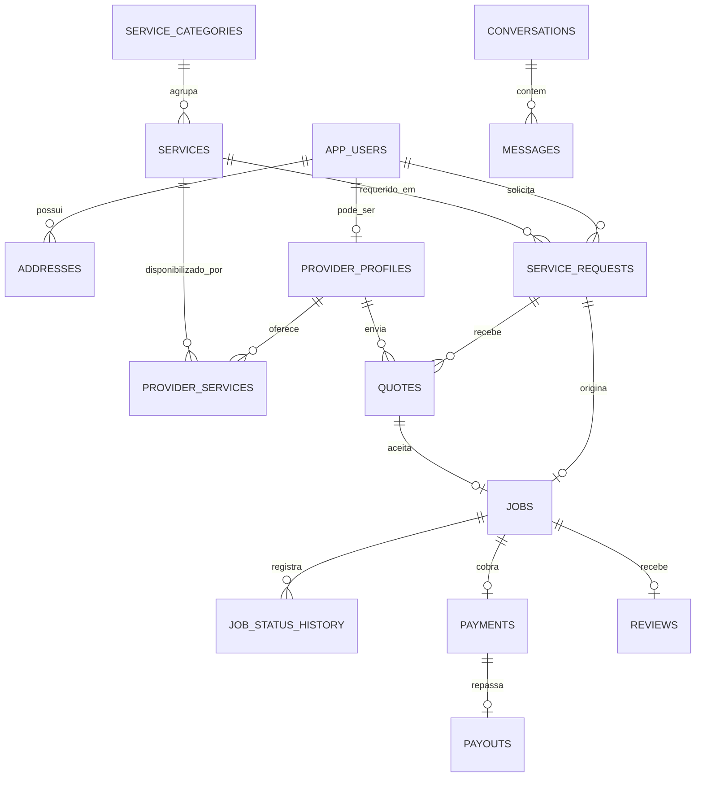

# Banco de dados — TA PRONTO

Modelo base para PostgreSQL 15+, derivado do DER de marketplace de serviços e dos fluxos existentes no frontend.

## Domínios

- Identidade: `app_users`, `user_roles` e `addresses`.
- Prestadores: perfil, documentos, disponibilidade, portfólio e serviços oferecidos.
- Catálogo: categorias hierárquicas e serviços.
- Contratação: solicitação, anexos, propostas, serviço contratado e histórico de status.
- Comunicação: conversas e mensagens.
- Financeiro: pagamentos e repasses ao prestador.
- Confiança: avaliações, favoritos, notificações e auditoria.

## Fluxo principal

1. O visitante pesquisa serviço e localização sem precisar de conta.
2. Ao solicitar, o cliente é autenticado e cria uma `service_request`.
3. Prestadores compatíveis enviam `quotes`.
4. A proposta aceita gera um `job` e uma `conversation`.
5. Cada mudança é registrada em `job_status_history`.
6. O pagamento gera um `payment`; o valor do prestador segue para `payouts`.
7. Após a conclusão, o cliente pode criar uma única `review` para o serviço.

## Relações principais



## Aplicação

```bash
psql "$DATABASE_URL" -f database/migrations/001_initial_schema.sql
psql "$DATABASE_URL" -f database/seed.sql
```

## Decisões importantes

- UUIDs evitam IDs sequenciais expostos nas URLs públicas.
- Valores monetários usam `numeric(12,2)`, nunca ponto flutuante.
- Exclusão de usuário é lógica (`deleted_at`), preservando histórico financeiro.
- Chaves estrangeiras usam `restrict` nos registros financeiros e operacionais.
- Dados externos de pagamento ficam em `provider_reference`; dados de cartão não devem ser armazenados.
- Latitude/longitude já permitem um MVP. Para busca geográfica em escala, migre para PostGIS e índice GiST.
- Autenticação pode ser delegada a Supabase Auth, Clerk ou outro provedor; nesse caso, `app_users.id` deve espelhar o ID externo.

## Próximas migrations recomendadas

1. Políticas de acesso por linha (RLS), especialmente ao usar Supabase.
2. Cupons, campanhas e regras de desconto.
3. Disputas, reembolsos e evidências.
4. Webhooks e eventos idempotentes do gateway de pagamento.
5. Geolocalização com PostGIS.
